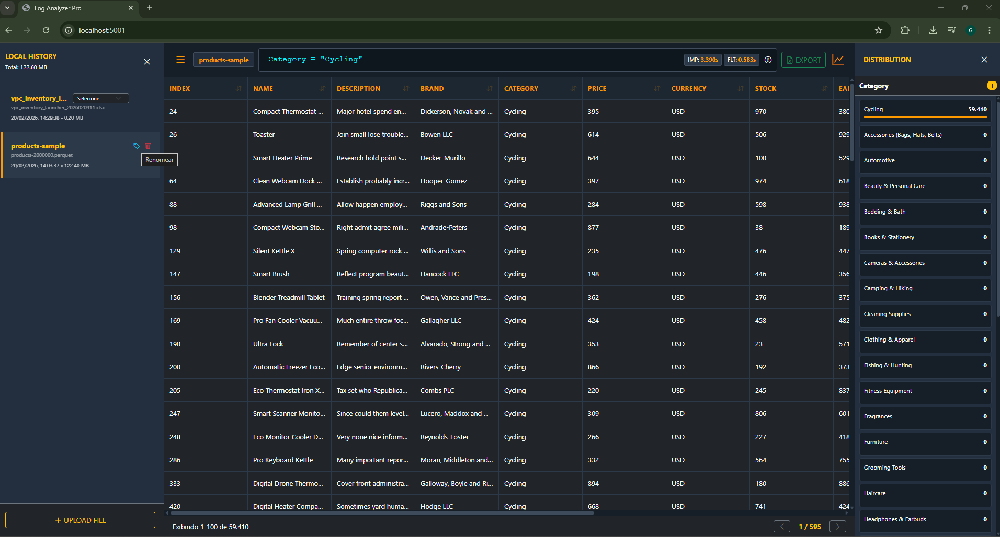

# Log Analyzer

O Log Analyzer é uma plataforma avançada de análise de dados via navegador web. A ferramenta permite processar, filtrar e analisar grandes volumes de logs e tabelas (CSV, XLSX, Parquet) diretamente no navegador, utilizando um backend Python otimizado para operações em memória.



## Arquitetura e Fluxo de Dados

A aplicação utiliza uma abordagem híbrida para garantir velocidade e segurança:

1. **Ingestão:** Os arquivos são carregados via Drag & Drop ou seletor convencional.
2. **Conversão:** Arquivos CSV e Excel são convertidos instantaneamente para o formato Parquet através do motor PyArrow no servidor.
3. **Persistência Local:** O arquivo convertido é enviado de volta ao navegador e armazenado no IndexedDB. Isso garante que, após o primeiro upload, o acesso aos dados seja imediato e offline (do ponto de vista de dados).
4. **Análise em Cache:** Para operações de filtragem complexas (JQL), o sistema utiliza um cache de sessão no servidor para manter os DataFrames em memória, garantindo respostas em milissegundos.

## Funcionalidades Detalhadas

### Processamento de Arquivos
- **Suporte Nativo a Parquet:** Utiliza o formato colunar para máxima eficiência de leitura e compressão.
- **Motor Multi-Abas (Excel):** Identifica automaticamente múltiplas planilhas dentro de um único arquivo .xlsx.
- **Otimização de Tipos de Dados:** Conversão automática de colunas de texto com baixa cardinalidade para o tipo Category do Pandas, reduzindo drasticamente o consumo de memória.

### Interface de Usuário
- **Design de Alta Fidelidade:** Interface em Dark Mode inspirada em ferramentas de monitoramento modernas, com painéis retráteis e micro-animações.
- **Sidebar Expansível (320px):** Espaço otimizado para visualização de nomes longos de arquivos e metadados.
- **Histórico Agrupado:** Arquivos com múltiplas abas são exibidos como uma única entrada no histórico, contendo um seletor interno para alternar entre as planilhas.
- **Ordenação Cronológica:** O histórico é organizado pela data e hora exata da importação mais recente.

### Análise e Filtragem
- **JQL (JSON Query Language):** Linguagem de consulta customizada que permite filtros complexos com operadores de igualdade (=), inclusão (~) e exclusão (!~).
- **Agrupamento Lógico Inteligente:** Suporte a parênteses e operadores AND/OR. O sistema agrupa filtros automaticamente ao interagir com a interface para evitar seleções conflitantes.
- **Distribuição de Frequência:** Clique em qualquer cabeçalho de coluna para visualizar os 50 valores mais frequentes, com barras de progresso proporcionais e contagem de valores únicos.
- **Filtro Rápido:** Capacidade de aplicar filtros JQL instantaneamente ao clicar em itens da distribuição estatística.

### Exportação e Relatórios
- **Exportação XLSX:** Gera arquivos Excel baseados no estado atual dos filtros aplicados, preservando a higienização dos dados.
- **Nomenclatura Dinâmica:** Os nomes dos arquivos exportados respeitam as tags customizadas definidas pelo usuário.

---

## Diferenciais de Segurança e Performance

- **Privacidade por Design:** O servidor é stateless. Nenhum dado do usuário é persistido em disco no ambiente de nuvem; as informações residem apenas no cache de memória volátil e no banco de dados local (IndexedDB) do próprio usuário.
- **Escalabilidade Cloud-Ready:** Preparado para deploy horizontal através de containers Docker e infraestrutura como código (Terraform) na AWS.
- **Monitoramento de Resource:** Exibição clara do tempo de importação e processamento de consultas para garantir transparência sobre a performance.

---

## Estrutura de Infraestrutura

- **Docker:** Arquivos Dockerfile e docker-compose.yml inclusos para isolamento total de dependências.
- **Terraform:** Módulos para criação de VPC, ECS Cluster (Fargate), ECR e Load Balancers na AWS, permitindo um pipeline de deploy profissional em poucos minutos.

### Exemplo de Configuração do Backend (S3)
Para manter o estado do Terraform remotamente, você pode configurar um backend S3:
```hcl
terraform {
  backend "s3" {
    bucket = "tf-accid"
    key    = "path/ecs/svcname/terraform.tfstate"
    region = "us-east-1"
  }
}
```

---

## Como Executar

### Localmente com Python
1. Instale as dependências: `pip install -r requirements.txt`
2. Execute a aplicação: `python app.py`
3. Acesse: http://127.0.0.1:5001

### Localmente com Docker
1. Execute: `docker-compose up --build`

---

## Sintaxe de Consulta (JQL)

| Operador | Ação | Exemplo de Uso |
| :--- | :--- | :--- |
| = | Igualdade exata | status = "sucesso" |
| ~ | Busca parcial (Contém) | log_message ~ "timeout" |
| !~ | Exclusão parcial (Não contém) | level !~ "debug" |
| AND | Condição aditiva | status = "erro" AND user = "admin" |
| OR | Condição alternativa | code = 500 OR code = 503 |
| ( ) | Prioridade de lógica | status = "erro" AND (user = "a" OR user = "b") |

---
*Este projeto foi desenvolvido com foco em praticidade, velocidade absoluta e segurança de dados.*
