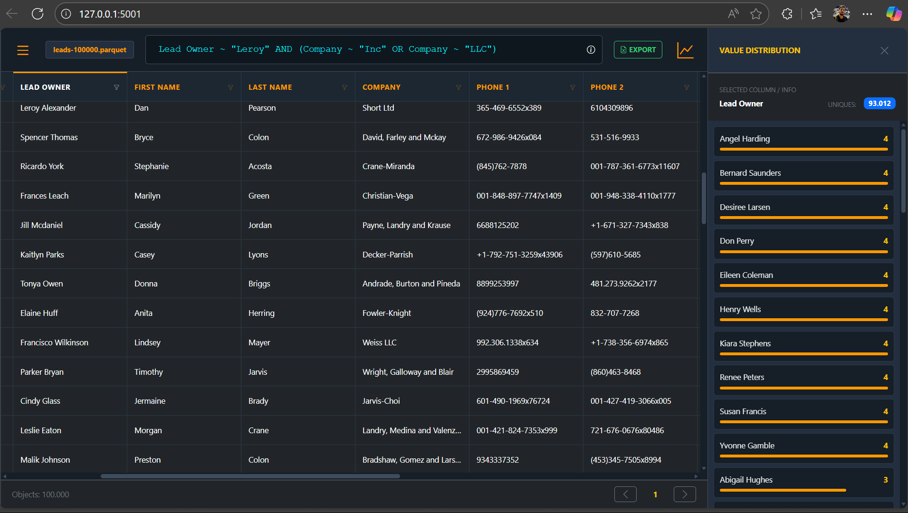

# CSV & Parquet Data Analyzer

Uma aplicação web robusta desenvolvida com **Python (Flask)** e **Pandas** para análise de grandes volumes de dados. O projeto converte arquivos CSV para o formato **Parquet**, garantindo consultas ultra-rápidas e análise estatística em tempo real.

## Funcionalidades

- **Conversão Automática:** Transforma CSVs pesados em arquivos Parquet otimizados.
- **JQL (JSON Query Language):** Filtros avançados com suporte a operadores `=` (igual), `~` (contém), `AND` e `OR`.
- **Análise de Colunas:** Distribuição de valores e frequências com um clique no cabeçalho.
- **Persistência:** Histórico de arquivos carregados com opção de renomear e excluir.
- **Exportação:** Gere relatórios em Excel (.xlsx) baseados nos seus filtros atuais.
- **UI Responsiva:** Interface Dark Mode com painéis laterais retráteis e feedback visual de carregamento.

---

## Requisitos

Para rodar este projeto, você precisará das seguintes bibliotecas:

* **Flask**: Servidor web.
* **Pandas**: Manipulação de dados.
* **PyArrow**: Motor para processamento de arquivos Parquet.
* **OpenPyXL**: Suporte para exportação de arquivos Excel.

---

## Como Executar

1. **Instale as dependências:**
   `pip install flask pandas pyarrow openpyxl`

2. **Inicie o servidor:**
   `python app.py`

3. **Acesse no navegador:**
   [http://127.0.0.1:5001](http://127.0.0.1:5001)

4. **Baixe um arquivo para testes**
   [https://www.datablist.com/learn/csv/download-sample-csv-files](https://www.datablist.com/learn/csv/download-sample-csv-files)

---

## Sintaxe de Busca (JQL)

| Operador | Descrição | Exemplo |
| :--- | :--- | :--- |
| `=` | Correspondência exata | `Status = "Concluído"` |
| `~` | Contém o termo | `Nome ~ "Gabriel"` |
| `AND` | Soma condições | `Setor = "TI" AND Salario ~ "5000"` |
| `OR` | Várias condições | `Idate = "26" OR Idade = "25"` |
| `( )` | Agrupamento | `Setor = "TI" AND (Idate = "26" OR Idade = "25")` |

---

## Estrutura do Projeto

* `app.py`: Backend Flask.
* `uploads/`: Pasta gerada para armazenar os Parquets.
* `templates/index.html`: Interface Frontend.